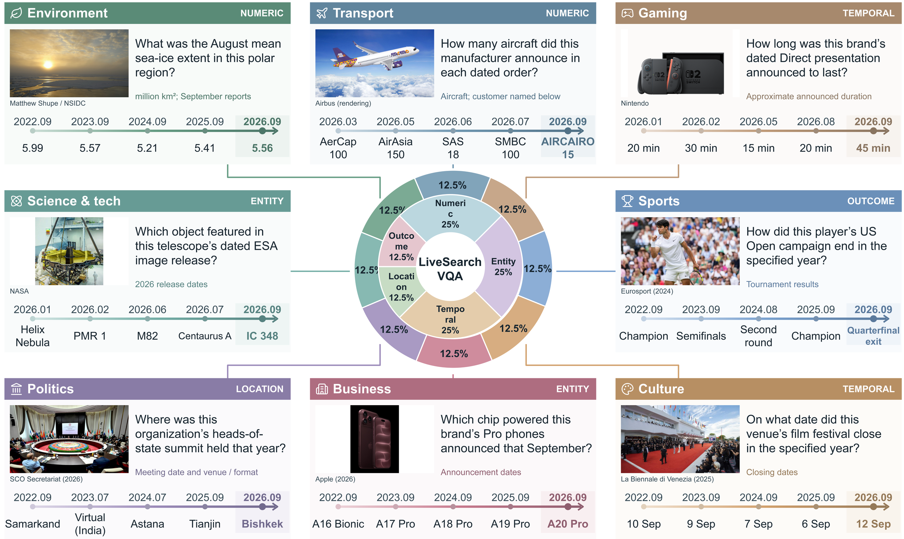

# LiveSearchVQA

**LIVE facts. SEARCH for evidence.**


A picture tells you what. The web tells you what changed.
We build dated visual questions whose answers require fresh, answer-bearing
evidence, then record item-level no-web and gold-evidence checks.

## Data availability — partial public release

This repository currently provides a **partial public release** of
LiveSearchVQA, including selected dated snapshots, the interactive showcase,
and construction code. A complete benchmark evaluation package is not included
in this snapshot. Additional data, evaluation code, and validation records are
planned for a later release. News-image reuse remains subject to the original
sources' rights.

The available files and snapshot counts are listed below. Construction-audit
summaries are in `data/releases/`. Construction-panel admission records do not
by themselves validate manuscript-level experimental results.

## Watch the walkthrough — no navigation needed


**LIVE:** time-stamped sources and on-demand construction.
**SEARCH:** resolve the visual clue, locate the right fact, distinguish nearby numbers.
**VERIFY:** retain the recorded P0/P1/P2 admission checks.

The animation uses the **September 5 archived preview**. It is an illustrated
walkthrough, not a recording of a new crawl or a measured agent search run.
Prompts and long answers on the cover are abridged; original records are unchanged.
The 36-second MP4 is included as `assets/live-search-demo.mp4` and plays in place
inside the HTML pages. The GIF above works directly in this README.

## One benchmark. A changing world.



*Author-supplied paper illustration. Timeline values and balanced sector shares
are illustrative, not measured distributions of the downloadable snapshots.*

## Explore the artifact

Interactive pages are included as `index.html`, `index_v2.html`, `demo.html`,
and `preview.html`. Use the local server below to view them. Case inspection,
answer reveal, filtering, video playback, and date switching work **in place**.
No project-authored hyperlinks, repository buttons, downloads, or source links
take the reader away from the page. Image viewers and repository navigation
added by a hosting platform itself are outside this artifact's control.

Identify the visual referent, search for a newly reported fact, and select the
right evidence. The demo includes image–question cases, source excerpts,
per-model responses, topic and answer-type distributions, and a dated-snapshot
selector. **Refreshes run only on explicit owner instruction—never on a schedule.**

## Anonymous review edition

**Navigation audit: 2026-09-25.** Markdown text links and all HTML hyperlinks
are disabled. News-source names remain as plain text; original provenance URLs
remain in the data for reproducibility. Run `src/check_anonymity.py` and
`src/check_navigation.py` to check the current artifact.

The August 18 data are now a **171-item English-only subset**. The 29 excluded
records had non-English source content; retained records are not translated or
recertified. The August 15 archive retains 200 items, and the September 5 preview
retains 121 items. This is an artifact-language revision, not a new data build.

## What the release means

The target is **200 items per requested build**, from English news published
within **48 hours of construction and release**, with at least **65% numeric or
temporal answers**. A target is not a guarantee of yield: a shortfall must not be
filled with old items or weaker certification.

The September 5 construction record (`data/releases/latest_attempt.json`)
reports **121/200 items** and a shortfall of 79, with machine-readable audits
under `data/releases/`.
When its target is not met, newly constructed items appear only in a clearly
labeled **incomplete preview**. Neither the preview nor the English-only legacy
subset is a claim of stable 200-item/day throughput.

| Gate | Required for a new release |
| --- | --- |
| P0 · Visual grounding | Image–source match, a meaningful omitted referent, explicit event question, no pixel-only answer |
| P1 · No-web screening | All 12 construction-panel attempts are graded incorrect |
| P2 · Evidence sufficiency | All 12 gold-evidence attempts are graded correct |
| Release audit | Exact source offsets and hashes, recorded trial verdicts, freshness, duplicate and composition checks |

The current live profile uses Doubao Seed 2.0 Pro for generation and
Qwen3.5 Flash, Qwen3-VL Plus, and Doubao Seed 2.0 Pro for certification, four
samples per condition. This is a **two-provider panel with a shared generator
member**, not three independent model families. P1/P2 are **finite,
panel-relative observations**, not guarantees about every future model.

## Repository map

| Path | Purpose |
| --- | --- |
| `src/crawler.py` | English-first RSS collection, article extraction and image deduplication |
| `src/generate_v2.py` | Evidence-first proposals, P0, and complete P1/P2 certification |
| `src/answer_equivalence.py` | Conservative deterministic answer comparison |
| `src/run_audit.py` | Private, credential-redacted request/response ledger |
| `src/validate_v2.py` | Offline invariants and promotion gate |
| `src/daily.py` | **Manually invoked** orchestration; historical filename only |
| `src/build_demo.py` | Reproducibly builds both the project homepage and demo |
| `src/build_construction_gif.py` | Rebuilds the illustrated construction animation |
| `src/build_showcase_media.py` | Rebuilds the cover, GIF, MP4, and storyboard without API calls |
| `assets/showcase-manifest.json` | Media provenance, archived item IDs, and file hashes |
| `src/supplement_v2.py` | Explicit bounded alternatives or exact-source formatting repair; no automatic promotion |
| `data/benchmark_v2.json` | 171-item English-only projection of the August 18 split |
| `data/archive_v2/` | Frozen dated snapshots |
| `data/releases/` | Public release manifests and audit summaries |
| `tests/` | Offline regression tests; no model calls |

Non-English legacy v1 data are excluded from this review edition. Legacy HTML
entry points open the anonymous English demo. `src/generate.py` is retained only
as legacy code; use the v2 paths above for current construction.

## Run a build explicitly

Python 3.10 or newer:

```bash
pip install -r requirements.txt
# Copy .env.example to .env locally and fill in your own credentials.
python -m unittest discover -s tests -v
python src/daily.py
```

`daily.py` stages candidates, validates the full target, archives the previous
split, and only then promotes a release. A failure leaves the published split
unchanged. Do not bypass the validator to hit the target.

For offline page rebuilds (no paid API calls):

```bash
python src/build_construction_gif.py
# Optional: requires ffmpeg on PATH; no model calls.
python src/build_showcase_media.py
python src/build_demo.py
python src/build_demo.py --preview data/previews/2026-09-05.json
python -m http.server 8000 --bind 127.0.0.1
```

## Credentials, provenance, and reuse

- Set `ARK_API_KEY` and `QWEN_API_KEY` in the environment or a local ignored
  `.env`. GitHub Actions uses repository Secrets; never paste keys into code.
- `.runs/` contains private sanitized API logs and source snapshots. Do not
  upload it. Public records contain short evidence excerpts, provenance hashes,
  decoding settings, and certification outcomes—not authorization headers.
- Actual billed dollars require provider billing records; token counts alone
  are not an invoice. Missing billing information is reported as unknown.
- News images remain owned by their respective sources. Attribution names and
  data provenance are retained; inclusion is not a blanket redistribution license.
- The rebuild workflow is `workflow_dispatch` only. Updating the static
  site does not trigger generation or paid model calls.
- Before publishing, run `python src/check_anonymity.py`. Create a history-free
  artifact with `python src/package_anonymous.py --output anonymous-review.zip`.
  Never submit `.git`, local credentials, or private logs.
