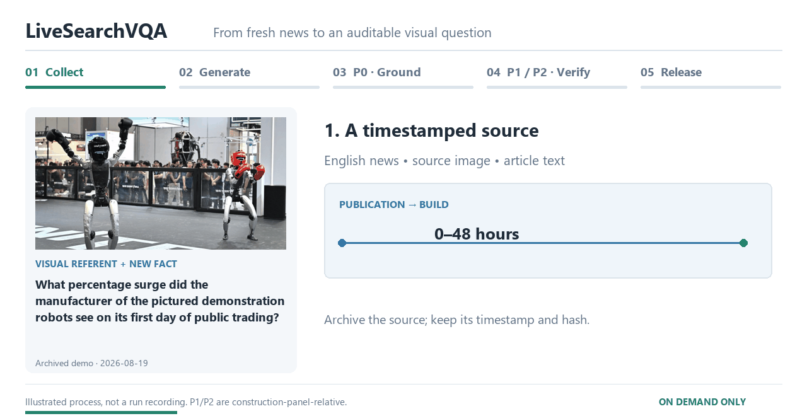

# LiveSearchVQA

**Fresh visual questions. Auditable construction. Diagnosable search.**

[**Open the interactive demo →**](https://hangeramber.github.io/LiveSearchVQA/)
 · [Download the current split](data/benchmark_v2.json)
 · [Construction protocol](docs/PROTOCOL.md)
 · [Current manuscript](docs/manuscript.pdf)

[](https://hangeramber.github.io/LiveSearchVQA/#construction)

Identify the visual referent, search for a newly reported fact, and select the
right evidence. The demo includes image–question cases, source excerpts,
per-model responses, topic and answer-type distributions, and a dated-snapshot
selector. **Refreshes run only on explicit owner instruction—never on a schedule.**

## What the release means

The target is **200 items per requested build**, from English news published
within **48 hours of construction and release**, with at least **65% numeric or
temporal answers**. A target is not a guarantee of yield: a shortfall must not be
filled with old items or weaker certification.

| Gate | Required for a new release |
| --- | --- |
| P0 · Visual grounding | Image–source match, a meaningful omitted referent, explicit event question, no pixel-only answer |
| P1 · No-web screening | All 12 construction-panel attempts are graded incorrect |
| P2 · Evidence sufficiency | All 12 gold-evidence attempts are graded correct |
| Release audit | Exact source offsets and hashes, recorded trial verdicts, freshness, duplicate and composition checks |

The current live profile uses Doubao Seed 2.0 Pro for generation and
Qwen3.5 Flash, Qwen3-VL Plus, and Doubao Seed 2.0 Pro for certification, four
samples per condition. This is a **two-provider panel with a shared generator
member**, not three independent model families. P1/P2 are **finite,
panel-relative observations**, not guarantees about every future model.

The September 5, 2026 manuscript is a **working draft with synthetic numerical
demonstrations**. Those experiment tables are not live model measurements.
API-backed construction records in this repository are a separate artifact;
they do not establish held-out transfer, expert agreement, causal distraction
effects, or a real 30-day evaluation. New items are marked `not_yet_audited`
until independent human ratings exist. Archived August builds retain their
original, older provenance schema and are not retroactively certified under
the new audit implementation.

## Repository map

| Path | Purpose |
| --- | --- |
| `src/crawler.py` | English-first RSS collection, article extraction and image deduplication |
| `src/generate_v2.py` | Evidence-first proposals, P0, and complete P1/P2 certification |
| `src/answer_equivalence.py` | Conservative deterministic answer comparison |
| `src/run_audit.py` | Private, credential-redacted request/response ledger |
| `src/validate_v2.py` | Offline invariants and promotion gate |
| `src/daily.py` | **Manually invoked** orchestration; historical filename only |
| `src/build_demo.py` | Reproducibly builds both the project homepage and demo |
| `src/build_construction_gif.py` | Rebuilds the illustrated construction animation |
| `data/benchmark_v2.json` | Current published open-ended split |
| `data/archive_v2/` | Frozen dated snapshots |
| `data/releases/` | Public release manifests and audit summaries |
| `docs/manuscript.pdf` | User-supplied current manuscript (September 5, 2026) |
| `paper/` | Earlier LaTeX draft; retained for provenance, not the current manuscript |
| `tests/` | Offline regression tests; no model calls |

`data/benchmark.json`, `src/generate.py`, and the old table pages are legacy v1
artifacts. Use the v2 paths above for current construction.

## Run a build explicitly

Python 3.10 or newer:

```bash
pip install -r requirements.txt
# Copy .env.example to .env locally and fill in your own credentials.
python -m unittest discover -s tests -v
python src/daily.py
```

`daily.py` stages candidates, validates the full target, archives the previous
split, and only then promotes a release. A failure leaves the published split
unchanged. Do not bypass the validator to hit the target.

For offline page rebuilds (no paid API calls):

```bash
python src/build_construction_gif.py
python src/build_demo.py
python -m http.server 8000 --bind 127.0.0.1
```

## Credentials, provenance, and reuse

- Set `ARK_API_KEY` and `QWEN_API_KEY` in the environment or a local ignored
  `.env`. GitHub Actions uses repository Secrets; never paste keys into code.
- `.runs/` contains private sanitized API logs and source snapshots. Do not
  upload it. Public records contain short evidence excerpts, provenance hashes,
  decoding settings, and certification outcomes—not authorization headers.
- Actual billed dollars require provider billing records; token counts alone
  are not an invoice. Missing billing information is reported as unknown.
- News images remain owned by their respective sources. Source links are
  retained; inclusion here is not a blanket license to redistribute them.
- The rebuild workflow is `workflow_dispatch` only. Updating the static
  GitHub Pages site does not trigger generation or paid model calls.
